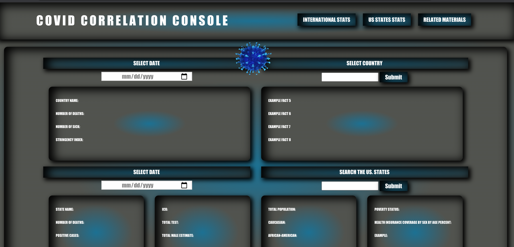

# Covid Correlation Console ("covid-correlation-console")

## Table of Contents

* [Deployed Site](#deployed-site)
* [User Story](#user-story)
* [Description](#description)
* [Process](#process)
* [Screenshots](#screenshots)
* [Sources](#sources)
* [Installation](#installation)
* [Contributing](#contributing)

## Deployed Site
---
Deployed Website: https://smoyamendez.github.io/covid-correlation-console/

## User Story
---
AS A USER,
I WANT to have a place where I can retrieve accurate COVID-19 statistics for the United States and internationally,
SO THAT I can see how the stringency guidelines a specific country’s government had on COVID-19 policies affected the number of deaths and cases, 
& THAT I can get up to date information on US state current COVID-19 status as compared to national US status.

## Description
---
This repository ("covid-correlation-console") is a collaborative project that uses HTML, CSS, and JavaScript to create a console where a user can see accurate COVID-19 statistics. Our site is a tool to get statistics both for United States and Internationally. We wanted to develop a place where a user can go to retrieve accurate statistics to compare different demographics and stringency levels correlate with COVID-19 outcomes.

## Process
---
We used Foundation to get the basic framework of our HTML. To pull in the information, we used three different API sources (see sources below) to fetch the data and display the statistics. 

## Screenshots
---
Home Page

## Sources
---
### APIs
* [Oxford Covid Stringency Project](https://www.bsg.ox.ac.uk/research/research-projects/coronavirus-government-response-tracker)
* [COVID Tracking Project](https://covidtracking.com/data/api/version-2)
* [US Census](https://www.census.gov/data/developers.html)

### Related Materials
* [Oxford Government Response Tracker](https://www.bsg.ox.ac.uk/research/research-projects/coronavirus-government-response-tracker)

## Installation
---
No need for any installation for this project.

See deployed site here: https://smoyamendez.github.io/covid-correlation-console/

See repository here: https://github.com/smoyamendez/covid-correlation-console

## Contributing
---
This project is a collaborative effort between the following people:
* HTML Mainster: Laura Cejas [@Lauracejas](https://github.com/Lauracejas)
* CSS Mainster: Carlos Abril [@cabril87](https://github.com/cabril87git)
* Javascript Mainster: James Jordan [@codeWarrior-debug](https://github.com/codeWarrior-debug)
* API Mainster: Joshua Wallace [@jwallace212](https://github.com/jwallace212)
* GitLord: Sommer Moya-Mendez [@smoyamendez](https://github.com/smoyamendez)

Please review and let us know if you see any ways this code can be improved.

